# LOOP — 36-Hour Build Plan

> **Governing rule:** the brief is the hero, the loop is the engine. Build loop-first,
> brief-as-payoff. The brief is only impressive if it's made of real interval data.

---

## Priority stack — memorise

```
1. SEED VISIT + COMMITMENTS + CHECK-INS   ← the demo's spine; the brief is made of this
2. THE COMMITMENT EXTRACTOR               ← what makes LOOP not-a-scribe
3. THE NEXT-VISIT BRIEF                    ← THE HERO
4. THE INTERVAL LOOP (voice check-ins)     ← the engine that fills the record
5. THE MCP SERVER                          ← sponsor depth; wires the loop
6. LIVE CAPTURE (ElevenLabs Scribe)        ← the opening beat; riskiest dependency
7. ONE SCREEN
```

**By hour ~16 you must have: seed → extractor → brief working end to end.** That's a
submittable demo (paste a transcript, extract, generate the brief). Everything above the
line is upside; live capture is the last thing because it's the riskiest.

---

## Timeline

```mermaid
gantt
    accTitle: LOOP 36-hour schedule
    accDescr: Foundation and seed, then the extractor and brief as the core with a milestone at hour 16, then the voice loop and MCP, then live capture, surface, and rehearsal.
    dateFormat HH
    axisFormat %H
    section Foundation
    Supabase + schema + RLS   :a1, 00, 3h
    Seed visit+commitments+checkins :a2, after a1, 3h
    section Core (the payoff path)
    Commitment extractor       :b1, after a2, 4h
    THE BRIEF                   :b2, after b1, 4h
    Brief working end-to-end    :crit, milestone, m1, 16, 0h
    section Engine
    MCP server                 :c1, after b2, 3h
    Voice check-in loop        :c2, after c1, 4h
    section Capture (riskiest)
    ElevenLabs Scribe capture  :d1, after c2, 4h
    section Surface
    One screen                 :e1, after d1, 5h
    section Ship
    Rehearse + time-compress   :crit, f1, 33, 3h
```



---

## Phase 0 — Foundation (H0–H6)

**H0–H3 · Supabase**
- [ ] `supabase init`, link, run `0001_init.sql`
- [ ] RLS on every table (service_role policy fine for demo)
- [ ] Confirm read/write from a script

**H3–H6 · Seed**
- [ ] `src/seed/pots-visit.ts` — the 8 March visit transcript, 4 commitments, 3 interval check-ins (from SPEC)
- 🎭 **Language matters.** The transcript should sound like a real cardiology consult; the check-ins like a real tired person. The whole demo's credibility is here.
- [ ] Sanity check: does the check-in data contain the *postprandial dizziness* detail? That's the payoff signal the brief will surface.

---

## Phase 1 — The payoff path (H6–H16) ⭐

**H6–H10 · Commitment extractor**
- [ ] `src/agents/extract.ts`, prompt from SPEC
- [ ] Feed the transcript → get summary + commitments
- [ ] Parse defensively, log raw

Acceptance — extractor MUST:
1. Produce 4 commitments (midodrine trial, ferritin test, watch dizziness, salt/fluids)
2. Capture `review_after: "6 weeks"` on the midodrine trial
3. Capture a `discriminator` per commitment
4. NOT invent commitments that weren't agreed

**H10–H14 · The brief (HERO)**
- [ ] `src/agents/brief.ts`, prompt from SPEC
- [ ] Join commitments to their check-ins, generate Agreed/Did/Happened/Flag
- Acceptance — the brief MUST:
  1. Show ferritin test as `not_done` with a flag
  2. Show midodrine as `partial` with the headache side effect
  3. Surface the **postprandial dizziness pattern** in `happened` or `open_questions` — this is the new signal the loop created, and it's the demo's "aha"
  4. Open with one honest headline sentence

### 🚩 MILESTONE H16
Paste transcript → extractor → (seed check-ins) → **brief renders, honestly, with the postprandial signal.** Commit. Screenshot. You have a submittable demo.

---

## Phase 2 — The engine (H16–H23)

**H16–H19 · MCP server**
- [ ] `supabase/functions/mcp/index.ts` — 4 tools from SPEC
- [ ] Test from Claude Desktop first, then confirm ElevenLabs sees it

**H19–H23 · Voice check-in loop**
- [ ] Create ElevenLabs agent, attach MCP, `keyterms`, system prompt from SPEC
- [ ] Test: calls `get_open_commitments` first; asks only about the due commitment; `append_checkin` writes back
- ⚠️ Trap: `@elevenlabs/client` WebRTC can stall on newer `livekit-client`. If session won't start / `/rtc/v1 404`, pin `livekit-client` to `2.16.1`.

---

## Phase 3 — Capture, the riskiest bit (H23–H27)

- [ ] `src/capture/scribe.ts` — record audio (patient device), ElevenLabs Scribe → transcript
- [ ] Feed transcript straight into the extractor
- ⚠️ This is LAST on purpose. If it breaks, the fallback (paste/pre-recorded transcript) keeps the whole demo intact. **Do not let capture jeopardize the payoff path.**

---

## Phase 4 — Surface (H27–H32)

- [ ] One Next.js screen (layout in SPEC)
- [ ] Capture button (with paste fallback)
- [ ] Summary + commitment count
- [ ] Interval timeline (the check-ins)
- [ ] **The brief, prominent, with Generate + Export** — this is the hero, give it the visual weight
- Cut order if short: capture UI → summary → timeline. **Never cut the brief.**

---

## Phase 5 — Ship (H32–H36)

- [ ] **Rehearse the time-compression.** The demo crosses "6 weeks" in 3 minutes — practice the narration that makes that legible ("let's fast-forward through the interval...").
- [ ] Pre-recorded voice-call fallback (wifi insurance)
- [ ] Brief screenshot in slides
- [ ] Know the 5 attack answers (CLAUDE.md) — especially "why won't Epic just do this" (three walls)
- [ ] Practice the line: *"We turn every visit from a cold start into a warm one."*

---

## Cut lines — decide now

| Breaks | Do |
|---|---|
| Live capture (Scribe) | Paste/pre-recorded transcript. Demo fully intact. |
| Voice check-in loop | Seed the check-ins directly; narrate "the agent collected these over 6 weeks." Brief still lands. |
| MCP server | Agents hit the DB directly. Lose architecture story, keep product. |
| Everything but the core | Paste transcript → extractor → brief. That's the submission. |

---

## Do NOT build
Doctor-side SOAP notes · EHR/FHIR write-back · anything advisory (CDS line) · wearable FM · auth · multi-patient · settings.
