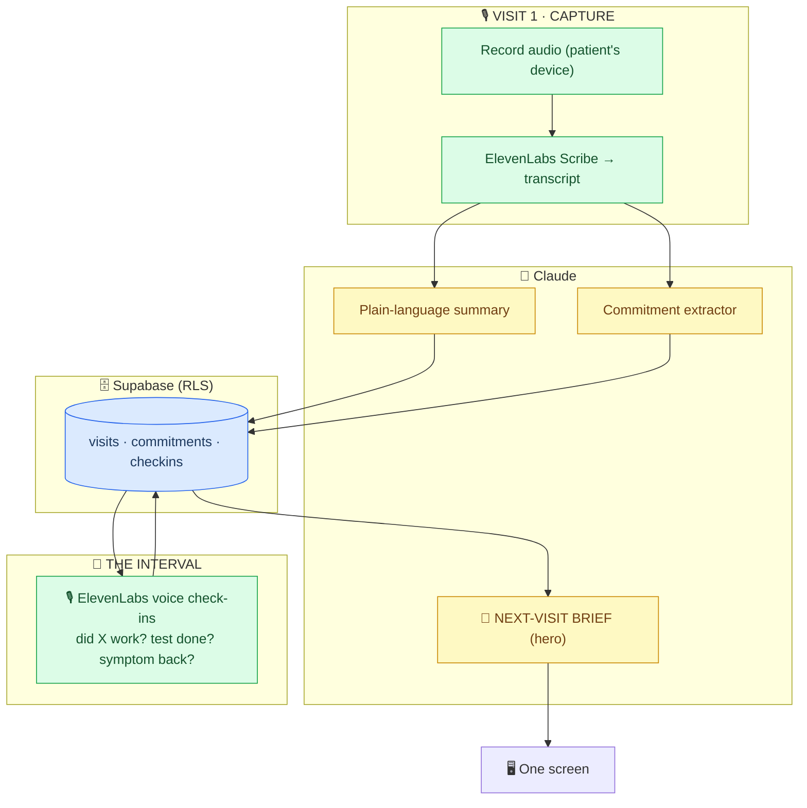

# LOOP — Technical Specification

> Read `CLAUDE.md` first. This is *what to build*. Build order: capture → extract → loop → **brief (hero)**.

---

## Architecture



---

## Database schema

Design notes:
- A **visit** anchors an interval. A **commitment** is something agreed *in* a visit to be checked *after*. A **checkin** is a follow-through data point against a commitment.
- Everything is patient-owned. RLS from the start.
- The next-visit brief is *derived* — a join of commitments to their checkins, reasoned over by Claude. Don't store it as a blob; regenerate it.

```sql
create extension if not exists vector;
create extension if not exists "uuid-ossp";

create table patients (
  id uuid primary key default gen_random_uuid(),
  label text,
  conditions text[],                 -- chronic wedge: ['POTS','ME/CFS']
  created_at timestamptz default now()
);

create table visits (
  id            uuid primary key default gen_random_uuid(),
  patient_id    uuid not null references patients(id) on delete cascade,
  visited_at    timestamptz not null,
  clinician     text,                -- 'Dr Okafor, cardiology'
  transcript    text,                -- from ElevenLabs Scribe
  summary       text,                -- Claude plain-language summary
  created_at    timestamptz default now()
);

create type commitment_kind as enum ('trial','test','watch','referral','medication','lifestyle');
create type commitment_status as enum ('open','done','not_done','partial','superseded');

create table commitments (
  id            uuid primary key default gen_random_uuid(),
  visit_id      uuid not null references visits(id) on delete cascade,
  patient_id    uuid not null references patients(id) on delete cascade,
  kind          commitment_kind not null,
  description   text not null,       -- "Try midodrine 2.5mg for 6 weeks, then reassess"
  review_after  interval,            -- '6 weeks'
  review_by     timestamptz,         -- computed: visited_at + review_after
  discriminator text,                -- what would tell us it worked / didn't
  status        commitment_status default 'open',
  created_at    timestamptz default now()
);

create table checkins (
  id            uuid primary key default gen_random_uuid(),
  commitment_id uuid not null references commitments(id) on delete cascade,
  patient_id    uuid not null references patients(id) on delete cascade,
  checked_at    timestamptz not null,
  channel       text default 'voice',
  content       text not null,       -- what the patient reported
  signal        jsonb,               -- optional structured: {"symptom":"dizziness","change":"improved"}
  created_at    timestamptz default now()
);

alter table patients    enable row level security;
alter table visits      enable row level security;
alter table commitments enable row level security;
alter table checkins    enable row level security;
-- demo: service_role policy per table. Real: scope to auth.uid(). Mention in pitch.
```

---

## The commitment extractor (the technical core)

This is what makes LOOP not-a-scribe. A doctor-side scribe stops at the summary. LOOP reads the transcript and pulls out **the implicit forward-looking plan** — the things that define the interval.

### Prompt — `claude-sonnet-4-6`

```
You are reading a transcript of a medical visit, from the PATIENT's side.
Extract the forward-looking PLAN — everything agreed in this visit that should be
checked or followed up AFTER it. You are NOT diagnosing or advising. You are
capturing what was agreed, faithfully.

TRANSCRIPT: {transcript}
VISIT DATE: {visited_at}

For each commitment, capture:
- kind: trial | test | watch | referral | medication | lifestyle
- description: plain, specific, in the patient's language
- review_after: the time window if stated ("six weeks", "next visit") else null
- discriminator: what would tell us whether it worked / whether to act
  (e.g. "dizziness on standing improves", "blood test shows ferritin > 30")

Also produce a plain-language SUMMARY of the visit: what was discussed, what was
decided, in warm everyday words a tired person can read. No jargon. No advice.

Return ONLY JSON:
{
  "summary": "...",
  "commitments": [
    {"kind":"trial","description":"...","review_after":"6 weeks","discriminator":"..."}
  ]
}

If something was mentioned but NOT actually agreed (e.g. the doctor floated an option
and moved on), do NOT record it as a commitment. Only capture what was agreed.
```

---

## The follow-through voice agent (ElevenLabs)

Runs the interval. Given an open commitment near its `review_by`, calls the patient for a 30-second check.

```jsonc
{
  "name": "LOOP check-in",
  "conversation_config": {
    "agent": {
      "first_message": "Hi — quick check-in about your last appointment, less than a minute.",
      "prompt": { "prompt": "<system prompt below>", "llm": "claude-sonnet-4-6" }
    },
    "asr": { "provider": "scribe_realtime",
             "keyterms": ["midodrine","dizziness","orthostatic","blood test","ferritin",
                          "flare","fatigue","side effect"],
             "no_verbatim": true },
    "tts": { "voice_id": "<warm, calm, unhurried>" }
  },
  "platform_settings": { "trust_context": "high" },
  "mcp_servers": [{
    "type": "url", "url": "https://<project>.supabase.co/functions/v1/mcp",
    "name": "loop-record", "approval_mode": "fine_grained",
    "auto_approve": ["get_open_commitments","get_visit_summary"],
    "require_approval": ["append_checkin"]
  }]
}
```

### Voice agent system prompt

```
You check in with someone about a specific thing agreed at their last medical visit.
Keep it SHORT — under a minute. They may be tired or foggy.

BEFORE speaking, call get_open_commitments — the specific thing(s) to ask about today.
Ask ONLY about those. Reference the visit naturally: "At your appointment on the 8th,
Dr Okafor suggested trying X for six weeks — how's that going?"

Ask about the DISCRIMINATOR: the thing that tells whether it worked. If the commitment
was a test, ask if it happened. If a trial, ask if it helped and any side effects. If a
'watch', ask if the symptom came back.

NEVER advise, diagnose, or suggest changing anything. If asked what they should do, say
you're gathering this for their next appointment with the doctor.

When answered: call append_checkin with what they said (and a structured signal if clear:
improved / no change / worse / done / not done). Thank them, end. Don't pad.
```

---

## MCP server (Edge Function) — the loop's tools

`https://<project>.supabase.co/functions/v1/mcp` · HTTP streamable.

| Tool | Approval | Signature | Purpose |
|---|---|---|---|
| `get_open_commitments` | auto | `(patient_id)` | commitments due for check-in |
| `get_visit_summary` | auto | `(visit_id)` | context for the check-in |
| `append_checkin` | **approval** | `(commitment_id, checked_at, content, signal?)` | log follow-through |
| `get_interval_record` | auto | `(patient_id, since_visit_id)` | everything since last visit — feeds the brief |

Fine-grained approval: reads auto-run, writes ask. Correct posture for health data — say so in the pitch.

---

## The next-visit brief (THE HERO)

Generated on demand, before Visit 2. A Claude call over `get_interval_record`. Structured as
**Agreed → Did → Happened → Changed**, patient-carried, doctor-readable in 60 seconds.

### Prompt — `claude-sonnet-4-6`

```
You are producing a NEXT-VISIT BRIEF the patient will hand their doctor at the next
appointment. It closes the loop from the last visit. You are NOT diagnosing or advising —
you are reporting, faithfully, what was agreed and what happened in the interval.

LAST VISIT: {summary, visited_at, clinician}
COMMITMENTS + THEIR CHECK-INS: {commitments each with their checkins}

Produce a brief with four columns per item:
- AGREED: what was decided last visit
- DID: whether the patient did it (done / partial / not done — and honestly if not done)
- HAPPENED: what the patient reported (improved / no change / worse / side effects)
- FLAG: anything the doctor should know first (a side effect, a test not done, a symptom
  that returned) — factual, not advisory

Open with one honest sentence: how the interval went overall.
Keep it scannable in 60 seconds. Plain language. No jargon, no advice, no diagnosis.

Return ONLY JSON:
{
  "headline": "one honest sentence",
  "items": [{"agreed":"...","did":"done|partial|not_done","happened":"...","flag":"...|null"}],
  "open_questions": ["things the patient wants to raise, drawn from the check-ins"]
}
```

**Why four columns:** it mirrors how a doctor thinks (plan → adherence → outcome → alert) so it's *instantly* usable. The `not_done` honesty is a feature — an unactioned test is exactly what the doctor needs to see first.

---

## Seed data (build FIRST — the demo's spine)

One chronic patient (POTS), one prior visit, its commitments, and interval check-ins.

**Visit 1 — 8 March, Dr Okafor (cardiology):**
Transcript (short, role-played) covering: confirmed POTS suspicion; agreed to **try midodrine 2.5mg for 6 weeks then reassess**; **get a ferritin blood test** (low iron worsens POTS); **watch for dizziness on standing**; increase salt/fluids.

Extracted commitments:
| kind | description | review_after | discriminator |
|---|---|---|---|
| medication/trial | Try midodrine 2.5mg, 6 weeks, then reassess | 6 weeks | dizziness on standing improves; watch side effects |
| test | Get ferritin blood test | 2 weeks | ferritin result available |
| watch | Watch dizziness on standing | ongoing | frequency of near-faints |
| lifestyle | Increase salt + fluids | ongoing | — |

Interval check-ins (compressed for demo):
- **wk 2:** "Booked the blood test but haven't been yet." → ferritin test: `not_done`
- **wk 3:** "Midodrine helps a bit in the morning but I get a headache." → trial: `partial`, side effect
- **wk 5:** "Still nearly fainted twice this week, both after lunch." → watch: symptom persists, postprandial pattern

**The generated brief then honestly shows:** midodrine partially helping but causing headaches, ferritin test still not done (flag), dizziness persisting with a *postprandial* pattern the doctor didn't have before. That postprandial detail is new clinical signal the loop surfaced — the payoff.

---

## UI — one screen

Next.js. Priority if time runs short: **the brief > the loop timeline > the summary > the capture UI.**

```
┌─────────────────────────────────────────────┐
│  ▶ Record visit    (or paste transcript)     │  ← capture
├─────────────────────────────────────────────┤
│  Visit summary (plain language)              │
│  Commitments extracted: 4                    │
├─────────────────────────────────────────────┤
│  THE INTERVAL  (check-ins over 6 weeks)      │  ← loop timeline
│  ● wk2 test not done  ● wk3 partial+headache │
│  ● wk5 dizziness persists (postprandial)     │
├─────────────────────────────────────────────┤
│  📄 NEXT-VISIT BRIEF            [Generate]    │  ← HERO
│  Agreed · Did · Happened · Flag              │
│  [Export / hand to doctor]                   │
└─────────────────────────────────────────────┘
```

---

## Env
```
ELEVENLABS_API_KEY=  ELEVENLABS_AGENT_ID=
ANTHROPIC_API_KEY=
SUPABASE_URL=  SUPABASE_SERVICE_ROLE_KEY=  SUPABASE_ANON_KEY=
```

## Repo layout
```
loop/
├── CLAUDE.md SPEC.md PLAN.md PITCH.md SETUP.md README.md
├── supabase/migrations/0001_init.sql
├── supabase/functions/mcp/index.ts
├── src/capture/scribe.ts          # ElevenLabs Scribe → transcript
├── src/agents/extract.ts          # commitment extractor
├── src/agents/brief.ts            # THE HERO
├── src/seed/pots-visit.ts         # visit + commitments + check-ins
└── src/app/page.tsx               # one screen
```
